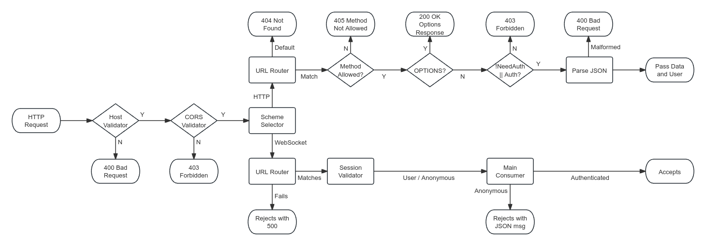
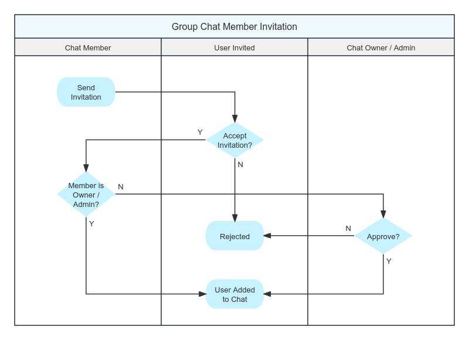

# Nova 210 SE: Backend Documentation

This document describes the backend modules and generic ideas of the Nova 210 SE project.

## General structure

Backend uses django and daphne to provide RESTful API for the frontend.

In the project root exists django's default entrance point, manage.py. This file is used to run django commands and start the server in debug env.

In production build, daphne is used to serve the backend, as it is faster and more reliable than django's default server.

We use Sqlite3 as the database, Django ORM is used to interact with the database; We use InMemoryChannelLayer for the websocket layer.

## Module structure and explanation

The directory structure of the backend project is as follows:

- `backend/`: Root directory of the backend project
  - `manage.py`: Django's default entrance point
  - `Dockerfile`: Dockerfile for building the backend image
  - `requirements.txt`: Python requirements file, states the ***top-level*** dependencies
  - `start.sh`: Docker image entrypoint script
  - `backend/`: Django project directory
    - `settings.py`: Django project settings file
    - `asgi.py`: Django ASGI configuration file
  - `data/`: Directory for storing sqlite3 database
  - `main/`: Main application directory, details written below

Main project files are shown below:

- `migrations/`: Directory for storing database migrations
- `models/`: Directory for storing Django models
  - `__init__.py`: Includes all models, acts as an entry point to make all models as a whole.
  - `_user.py`: User model, stores user information
  - `_friend_group.py`: FriendGroup model, stores friend group information
  - `_friend.py`: Friend model, stores friend information
  - `_friend_invitation.py`: FriendInvitation model, stores friend invitation information
  - `_chat.py`: Chat model, stores private / group chat information
  - `_user_chat_relation.py`: UserChatRelation model, stores user-specific chat information
  - `_chat_message.py`: ChatMessage model, stores chat message information
  - `_chat_invitation.py`: ChatInvitation model, stores chat invitation
- `views/`: Directory for storing Django views
  - `__init__.py`: Empty file to make the directory a package
  - `user.py`: User views, handles user-related operations, including login / register / get info
  - `friend_group.py`: FriendGroup views, handles friend group-related operations, including create / list / delete
  - `friend.py`: Friend views, handles friend-related operations, including invite / list / delete
  - `chat.py`: Chat views, handles chat-related operations, including create / list / set owner
  - `generate_avatar.py`: Utility to generate random avatars
  - `api_utils.py`: Foundamental API utilities, for example API decorators
- `ws/`: Directory for the main websocket consumer
  - `__init__.py`: Defines the consumer class itself
  - `_dispatcher.py`: Receive channel notifications and handle side-effects
  - `_notification_channel.py`: Define channels and which channel a session should join
  - `urls.py`: Defines the websocket URL routing
  - `action.py`: Defines client-to-server actions
  - `notification.py`: Defines server-to-client notifications
- `tests/`: Directory for storing unit tests and integration tests. Contents are self-explanatory
- `__init__.py`: Empty file to make the directory a package
- `exceptions.py`: Custom exceptions for the backend
- `urls.py`: Main URL routing file, includes all URL routes of the backend
- `apps.py`: Django app configuration file

## Understanding authentication mechanism

The backend uses HTTP Session to authenticate users. When any request arrives, authenication process looks like the folling graph; A similiar process is used for websocket messages to ensure the message is valid JSON.

<div style="text-align: center;">

</div>

## Understanding complex operations

Most operations in this software are straightforward, but some operations are complex and require multiple steps to complete. They are elaborated here to better understand the logic and prevent maintenance issues.

### Group chat member invitation

The ideal chat member invitation process is as follows. For simplicity, we have implemented a simplified version of the process:

<div style="text-align: center; display: flex; flex-direction: row;">


</div>
We would like to implement the ideal process in the future, if possible.

### User deletion

Quite a lot of operations are required to maintain a clean database before a user can be deleted. The process is as follows:

- All friends currently online should be notified that the user is to be deleted, so that the friendship and the corresponding no longer exists.
- All private chat with the user in it should be deleted (as standard friend deletion process is not called here), to avoid private chat with only one user.
- All owned group chat will be deleted (by CASCADE strategy), so all member in these chats should be notified of the deletion of chat.
- All owned group chat is actively deleted so that "user quit chat" notification will not be sent to those chats.
- All group chat that the user is still in should be notified that the user is leaving the chat.
- All friendship is deleted actively (although as per CASCADE strategy, this is not necessary).
- All active sessions of the user is notified to log out.
- The AuthUser is deleted.
- The User is deleted.

From here on, the function returns, but the following things will happen:

- User will be removed from chat member list and chat admin list
- All owned FriendGroup is deleted (by CASCADE strategy)
- All sent message transfered sender to #DELETED user
- User will be removed from Message read list
- All pending friend invitation and chat invitaton is deleted (by CASCADE strategy)
- All related UserChatRelation is deleted (by CASCADE strategy)

Now the user is completely deleted from the database without a chance to recover.

## Database structure & ORM & API data structure

### User model

Stores user information, database table name `main_user`.

Table relations:

- `auth_user`: Foreign key to Django's default user model, used for authentication. Database column `auth_user_id`, linked to `auth_user.id`.
- `default_group`: Foreign key to the default friend group of the user. Database column `default_group_id`, linked to `main_friendgroup.id`.

API structure: `to_basic_struct` and `to_detail_struct` methods are provided to convert the model to a JSON-serializable dictionary.

### FriendGroup model

Stores friend group information, database table name `main_friendgroup`.

Table relations:

- `user`: Foreign key to the user who owns the friend group. Database column `user_id`, linked to `main_user.id`.

API structure: `to_struct` method.

### Friend model

Stores friend information, database table name `main_friend`.

Table relations:

- `user`: Foreign key to the user who owns the friend. Database column `user_id`, linked to `main_user.id`.
- `friend`: Foreign key to the friend user. Database column `friend_id`, linked to `main_user.id`.
- `group`: Foreign key to the friend group the friend is in. Database column `group_id`, linked to `main_friendgroup.id`.

API structure: `to_struct` method.

### FriendInvitation model

Stores friend invitation information, database table name `main_friendinvitation`.

Table relations:

- `sender`: Foreign key to the user who sent the invitation. Database column `sender_id`, linked to `main_user.id`.
- `receiver`: Foreign key to the user who received the invitation. Database column `receiver_id`, linked to `main_user.id`.

API structure: `to_struct` method.

### Chat model

Stores chat information, database table name `main_chat`, `main_chat_admins`, `main_chat_members`.

Table relations:

- `owner`: Foreign key to the user who owns the chat. Database column `owner_id`, linked to `main_user.id`.
- `members`: Many-to-many relation to the users who are in the chat. Database table `main_chat_members`, `chat_id` linked to `main_chat.id`, `user_id` linked to `main_user.id`.
- `admins`: Many-to-many relation to the users who are admins of the chat. Database table `main_chat_admins`, `chat_id` linked to `main_chat.id`, `user_id` linked to `main_user.id`.

API structure: `to_struct` method.

### UserChatRelation model

Stores user-specific chat information, database table name `main_userchatrelation`.

Table relations:

- `user`: Foreign key to the user who is in the chat. Database column `user_id`, linked to `main_user.id`.
- `chat`: Foreign key to the chat the user is in. Database column `chat_id`, linked to `main_chat.id`.

API structure: `to_struct` method.

### ChatMessage model

Stores chat message information, database table name `main_chatmessage`, `main_chatmessage_read_users`, `main_chatmessage_deleted_users`.

Table relations:

- `chat`: Foreign key to the chat the message is in. Database column `chat_id`, linked to `main_chat.id`.
- `sender`: Foreign key to the user who sent the message. Database column `sender_id`, linked to `main_user.id`.
- `reply_to`: Foreign key to the message the message is replying to. Database column `reply_to_id`, linked to `main_chatmessage.id`.
- `read_users`: Many-to-many relation to the users who have read the message. Database table `main_chatmessage_read_users`, `message_id` linked to `main_chatmessage.id`, `user_id` linked to `main_user.id`.
- `deleted_users`: Many-to-many relation to the users who have deleted the message. Database table `main_chatmessage_deleted_users`, `message_id` linked to `main_chatmessage.id`, `user_id` linked to `main_user.id`.

API structure: `to_basic_struct` and `to_detailed_struct` method.

### ChatInvitation model

Stores chat invitation information, database table name `main_chatinvitation`.

Table relations:

- `invited_by`: Foreign key to the user who sent the invitation. Database column `invited_by_id`, linked to `main_user.id`.
- `chat`: Foreign key to the chat the user is invited to. Database column `chat_id`, linked to `main_chat.id`.
- `user`: Foreign key to the user who received the invitation. Database column `user_id`, linked to `main_user.id`.

API structure: `to_struct` method.

## Application Programming Interface

### User related

```python
    # Login to the system
    path('user/login', user.login, name='user_login'),

    # Register to the system
    path('user/register', user.register, name='user_register'),

    # Logout from the system
    path('user/logout', user.logout, name='user_logout'),

    # Query user information, patch update and delete user
    path('user', user.query, name='user'),

    # Get user information by ID
    path('user/<int:_id>)', user.get_user_info_by_id, name='user_by_id'),
```

### Friend and friend group

```python
    # Add friend group
    path('friend/group/add', friend_group.add, name="friend_group_add"),

    # Get friend group information, patch update and delete friend group
    path('friend/group/<int:group_id>', friend_group.query, name='friend_group_query'),

    # List friend groups
    path('friend/group/list', friend_group.list_groups, name='friend_group_list'),

    # Search for friends
    path('friend/find', friend.find, name='friend_find'),

    # Send friend invitation
    path('friend/invite', friend.send_invitation, name='friend_invite'),

    # List friend invitations
    path('friend/invitation', friend.list_invitation, name='friend_list_invitation'),

    # Respond to friend invitation, accept or reject
    path('friend/invitation/<int:invitation_id>', friend.respond_to_invitation, name='friend_respond_to_invitation'),

    # List friends
    path('friend', friend.list_friend, name='friend_list_friend'),

    # Get friend information, update nickname, delete friend
    path('friend/<int:friend_user_id>', friend.query, name='friend_query'),
```

### Private chat and group chat

```python
    # Create a new chat
    path('chat/new', chat.new_chat, name='chat_new'),

    # Invite a user to a chat
    path('chat/<int:chat_id>/invite', chat.invite_to_chat, name='chat_invite'),

    # List chat invitations
    path('chat/<int:chat_id>/invitation', chat.list_invitation, name='chat_list_invitation'),

    # Respond to chat invitation, accept or reject
    path('chat/<int:chat_id>/invitation/<int:user_id>', chat.respond_to_invitation, name='chat_respond_to_invitation'),

    # Get chat information, update chat, delete chat
    path('chat/<int:chat_id>', chat.query_chat, name='chat_get_delete'),

    # List chats
    path('chat', chat.list_chats, name='chat_list'),

    # Toggle chat admin
    path('chat/<int:chat_id>/<int:member_id>/admin', chat.set_admin, name='chat_set_admin'),

    # Set chat owner
    path('chat/<int:chat_id>/set_owner', chat.set_owner, name='chat_set_owner'),

    # Remove chat member
    path('chat/<int:chat_id>/<int:member_id>', chat.remove_member, name='chat_remove_member'),

    # List chat messages
    path('chat/<int:chat_id>/messages', chat.get_messages, name='chat_list_messages'),

    # Find chat messages
    path('chat/<int:chat_id>/filter', chat.filter_messages, name='chat_filter_messages'),

    # Catch all and return 404
    re_path('.*?', api_utils.not_found, name='not_found'),
]
```

## Where to find more information

Detailed comments and documentation is written in the source code. Please refer to the source code for more information.

For updated and exact struct backend will return in an API, check each model's `to_{}_struct` method.

## Appendix A: Detailed API documentation

! Include api_doc.md here
