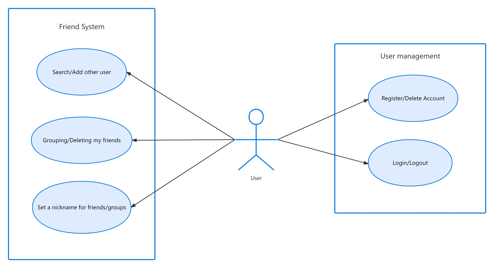
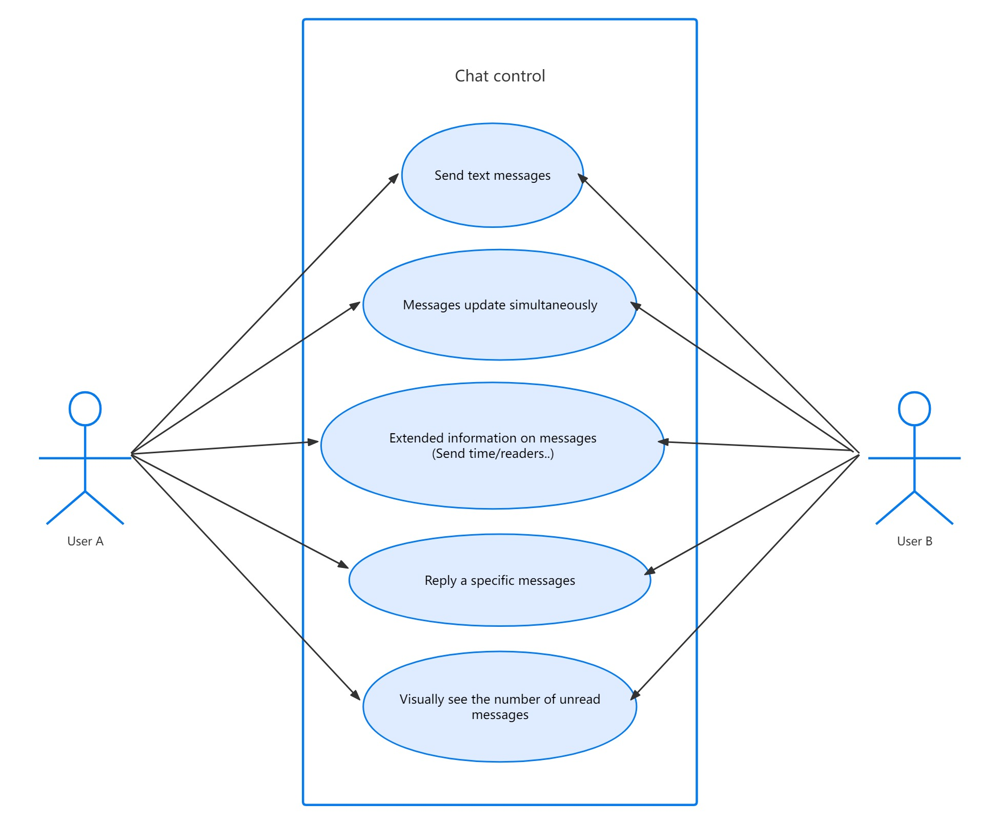
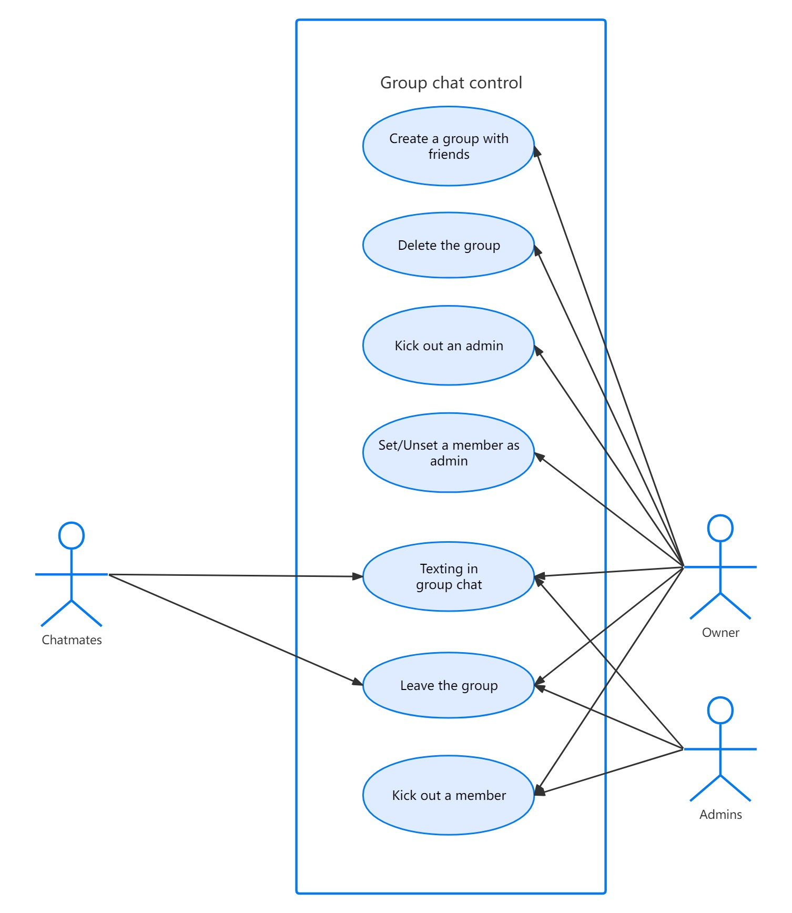
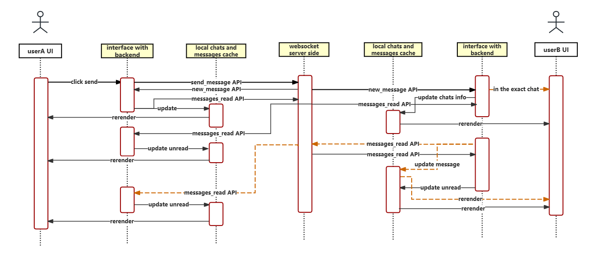
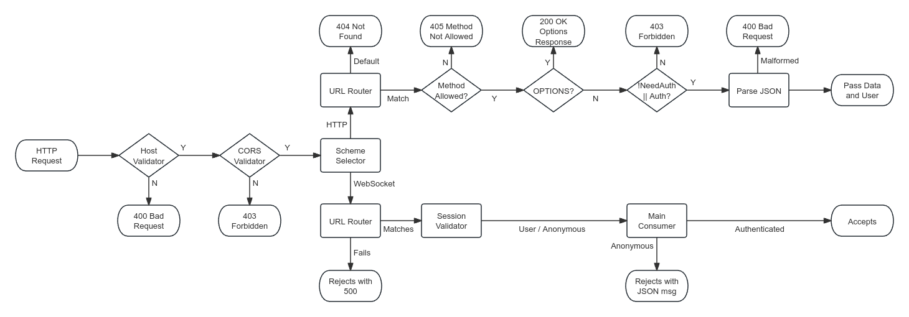
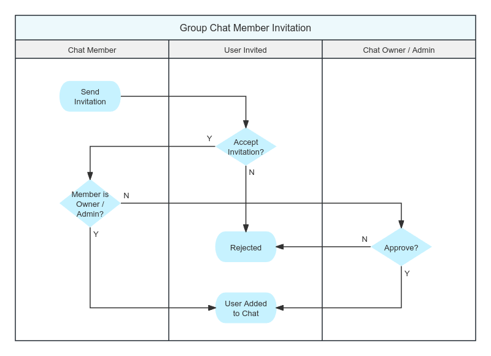
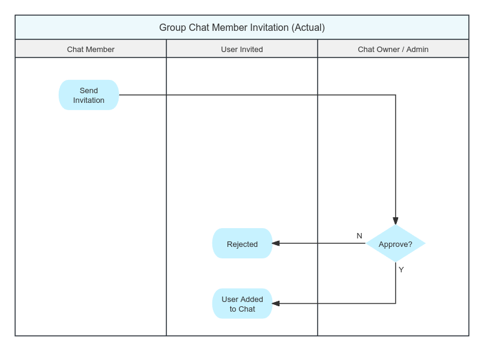

# Nova 210 SE: Documentation

## User Stories

- As a user, I want basic user mamagement functions and friend management functions.

<div style="text-align: center;">

</div>

- As a user, I want to chat with my friends in real-time.
- As a user, I want to chat with my friends in private chat rooms and manage the chat rooms.

<div style="text-align: center; display: flex; flex-direction: row;">


</div>

## Modules in Frontend

The following section lists the main modules in the frontend of the Nova 210 SE project. For detailed information, see Appendix.

- `index.tsx`: Router definition and the entry point of the APP.
- `utils/`: General utilities used in the APP, including type assertions, error page, data loaders, general types, validation error component, general consts, router paths, and websocket actions.
- `main_page/`: The main framework that users see except for the login page.
- `user_control/`: Related to the current user, including user settings page, login page, router guard, and components for diaplaying and editing user info.
- `friend_control/`: Related to managing friends relations and groups, including components for displaying friends and groups, and APIs for managing friends and groups.
- `chat_control/`: Related to chat rooms and messages, including components for displaying chats and messages, and APIs to manage them.
- `websockets/`: Websocket actions used in the APP, including data type definitions of websocket messages and a component to deal with received data.

Within each module, classes and functions are grouped by their functionalities. A `conponents` folder may present, containing all UI elements; while data related functions are placed in the root of the module.

## State Management

The state needed across the different components of the APP are stored and managed simply by standard `react context` or prop drilling. Neither Redux nor RxJS is used in this project because of the relatively minuscule size of the project. The state is managed in a way that is straightforward, easy to understand and maintain. If a state is needed by a child component, it is passed down as a prop. If a state is needed across components of different ancestors or should be updated by a child component, it is stored in a context provider that wraps the components that need the state. The state itself is for the most part initialized by `useState` and updated by the corresponding `setState`.

## Data Acquirement from RESTful APIs

Except for the data that travels through websockets due to the real-time demand, all the interactions are by RESTful APIs. There are two major components that are used for getting or acquiring data: loader from react-router and react-query from TanStack. These are two official or semi-official libraries that are widely used for RESTful API interaction and are powerful and flexible enough for a project with this kind of scale.

Loaders are used in most parts of data acquirement. When they're used, react-query is always bundled together to make deferred data fetching possible. This can make sure the page is not blocked by the data fetching process. QueryClient of react-query likewise manages the cache and reuses the data that has been fetched before. This can make sure the data is not fetched redundantly. If any update is needed, deleting the cache will commence the refetch process.

In the most interative and instant part of data fetching and updating, which is messasges display, `useQuery` from react-query is used. This will also ensure the cache part. What's more, an out-of-box custom context makes use of `refetch` from the return value of `useQuery` and can be used in any part of the APP to trigger the refetch process without a heavy load of rendering due to the benefit of react-query on receiving the corresponding websocket notifications. So new messages can be displayed in real-time with a very low latency.

## Websocket Interaction for Sending and Receving Messages in a Chat

Notification machenism based on WebSocket is utilized to send and receive messages. Several events occur when a message is sent in the order of the following graph.

<div style="text-align: center;">

</div>

## Backend General structure

Backend uses django and daphne to provide RESTful API for the frontend.

In the project root exists django's default entrance point, manage.py. This file is used to run django commands and start the server in debug env.

In production build, daphne is used to serve the backend, as it is faster and more reliable than django's default server.

We use Sqlite3 as the database, Django ORM is used to interact with the database; We use InMemoryChannelLayer for the websocket layer.

## Module structure and explanation

The directory structure of the backend project is as follows:

- `backend/`: Root directory of the backend project
  - `manage.py`: Django's default entrance point
  - `Dockerfile`: Dockerfile for building the backend image
  - `requirements.txt`: Python requirements file, states the ***top-level*** dependencies
  - `start.sh`: Docker image entrypoint script
  - `backend/`: Django project directory
    - `settings.py`: Django project settings file
    - `asgi.py`: Django ASGI configuration file
  - `data/`: Directory for storing sqlite3 database
  - `main/`: Main application directory, details written below

Main project files are shown below:

- `migrations/`: Directory for storing database migrations
- `models/`: Directory for storing Django models
  - `__init__.py`: Includes all models, acts as an entry point to make all models as a whole.
  - `_user.py`: User model, stores user information
  - `_friend_group.py`: FriendGroup model, stores friend group information
  - `_friend.py`: Friend model, stores friend information
  - `_friend_invitation.py`: FriendInvitation model, stores friend invitation information
  - `_chat.py`: Chat model, stores private / group chat information
  - `_user_chat_relation.py`: UserChatRelation model, stores user-specific chat information
  - `_chat_message.py`: ChatMessage model, stores chat message information
  - `_chat_invitation.py`: ChatInvitation model, stores chat invitation
- `views/`: Directory for storing Django views
  - `__init__.py`: Empty file to make the directory a package
  - `user.py`: User views, handles user-related operations, including login / register / get info
  - `friend_group.py`: FriendGroup views, handles friend group-related operations, including create / list / delete
  - `friend.py`: Friend views, handles friend-related operations, including invite / list / delete
  - `chat.py`: Chat views, handles chat-related operations, including create / list / set owner
  - `generate_avatar.py`: Utility to generate random avatars
  - `api_utils.py`: Foundamental API utilities, for example API decorators
- `ws/`: Directory for the main websocket consumer
  - `__init__.py`: Defines the consumer class itself
  - `_dispatcher.py`: Receive channel notifications and handle side-effects
  - `_notification_channel.py`: Define channels and which channel a session should join
  - `urls.py`: Defines the websocket URL routing
  - `action.py`: Defines client-to-server actions
  - `notification.py`: Defines server-to-client notifications
- `tests/`: Directory for storing unit tests and integration tests. Contents are self-explanatory
- `__init__.py`: Empty file to make the directory a package
- `exceptions.py`: Custom exceptions for the backend
- `urls.py`: Main URL routing file, includes all URL routes of the backend
- `apps.py`: Django app configuration file

## Understanding authentication mechanism

The backend uses HTTP Session to authenticate users. When any request arrives, authenication process looks like the folling graph; A similiar process is used for websocket messages to ensure the message is valid JSON.

<div style="text-align: center;">

</div>

## Understanding complex operations

Most operations in this software are straightforward, but some operations are complex and require multiple steps to complete. They are elaborated here to better understand the logic and prevent maintenance issues.

### Group chat member invitation

The ideal chat member invitation process is as follows. For simplicity, we have implemented a simplified version of the process:

<div style="text-align: center; display: flex; flex-direction: row;">


</div>
We would like to implement the ideal process in the future, if possible.

### User deletion

Quite a lot of operations are required to maintain a clean database before a user can be deleted. The process is as follows:

- All friends currently online should be notified that the user is to be deleted, so that the friendship and the corresponding no longer exists.
- All private chat with the user in it should be deleted (as standard friend deletion process is not called here), to avoid private chat with only one user.
- All owned group chat will be deleted (by CASCADE strategy), so all member in these chats should be notified of the deletion of chat.
- All owned group chat is actively deleted so that "user quit chat" notification will not be sent to those chats.
- All group chat that the user is still in should be notified that the user is leaving the chat.
- All friendship is deleted actively (although as per CASCADE strategy, this is not necessary).
- All active sessions of the user is notified to log out.
- The AuthUser is deleted.
- The User is deleted.

From here on, the function returns, but the following things will happen:

- User will be removed from chat member list and chat admin list
- All owned FriendGroup is deleted (by CASCADE strategy)
- All sent message transfered sender to #DELETED user
- User will be removed from Message read list
- All pending friend invitation and chat invitaton is deleted (by CASCADE strategy)
- All related UserChatRelation is deleted (by CASCADE strategy)

Now the user is completely deleted from the database without a chance to recover.

## Database structure & ORM & API data structure

### User model

Stores user information, database table name `main_user`.

Table relations:

- `auth_user`: Foreign key to Django's default user model, used for authentication. Database column `auth_user_id`, linked to `auth_user.id`.
- `default_group`: Foreign key to the default friend group of the user. Database column `default_group_id`, linked to `main_friendgroup.id`.

API structure: `to_basic_struct` and `to_detail_struct` methods are provided to convert the model to a JSON-serializable dictionary.

### FriendGroup model

Stores friend group information, database table name `main_friendgroup`.

Table relations:

- `user`: Foreign key to the user who owns the friend group. Database column `user_id`, linked to `main_user.id`.

API structure: `to_struct` method.

### Friend model

Stores friend information, database table name `main_friend`.

Table relations:

- `user`: Foreign key to the user who owns the friend. Database column `user_id`, linked to `main_user.id`.
- `friend`: Foreign key to the friend user. Database column `friend_id`, linked to `main_user.id`.
- `group`: Foreign key to the friend group the friend is in. Database column `group_id`, linked to `main_friendgroup.id`.

API structure: `to_struct` method.

### FriendInvitation model

Stores friend invitation information, database table name `main_friendinvitation`.

Table relations:

- `sender`: Foreign key to the user who sent the invitation. Database column `sender_id`, linked to `main_user.id`.
- `receiver`: Foreign key to the user who received the invitation. Database column `receiver_id`, linked to `main_user.id`.

API structure: `to_struct` method.

### Chat model

Stores chat information, database table name `main_chat`, `main_chat_admins`, `main_chat_members`.

Table relations:

- `owner`: Foreign key to the user who owns the chat. Database column `owner_id`, linked to `main_user.id`.
- `members`: Many-to-many relation to the users who are in the chat. Database table `main_chat_members`, `chat_id` linked to `main_chat.id`, `user_id` linked to `main_user.id`.
- `admins`: Many-to-many relation to the users who are admins of the chat. Database table `main_chat_admins`, `chat_id` linked to `main_chat.id`, `user_id` linked to `main_user.id`.

API structure: `to_struct` method.

### UserChatRelation model

Stores user-specific chat information, database table name `main_userchatrelation`.

Table relations:

- `user`: Foreign key to the user who is in the chat. Database column `user_id`, linked to `main_user.id`.
- `chat`: Foreign key to the chat the user is in. Database column `chat_id`, linked to `main_chat.id`.

API structure: `to_struct` method.

### ChatMessage model

Stores chat message information, database table name `main_chatmessage`, `main_chatmessage_read_users`, `main_chatmessage_deleted_users`.

Table relations:

- `chat`: Foreign key to the chat the message is in. Database column `chat_id`, linked to `main_chat.id`.
- `sender`: Foreign key to the user who sent the message. Database column `sender_id`, linked to `main_user.id`.
- `reply_to`: Foreign key to the message the message is replying to. Database column `reply_to_id`, linked to `main_chatmessage.id`.
- `read_users`: Many-to-many relation to the users who have read the message. Database table `main_chatmessage_read_users`, `message_id` linked to `main_chatmessage.id`, `user_id` linked to `main_user.id`.
- `deleted_users`: Many-to-many relation to the users who have deleted the message. Database table `main_chatmessage_deleted_users`, `message_id` linked to `main_chatmessage.id`, `user_id` linked to `main_user.id`.

API structure: `to_basic_struct` and `to_detailed_struct` method.

### ChatInvitation model

Stores chat invitation information, database table name `main_chatinvitation`.

Table relations:

- `invited_by`: Foreign key to the user who sent the invitation. Database column `invited_by_id`, linked to `main_user.id`.
- `chat`: Foreign key to the chat the user is invited to. Database column `chat_id`, linked to `main_chat.id`.
- `user`: Foreign key to the user who received the invitation. Database column `user_id`, linked to `main_user.id`.

API structure: `to_struct` method.

## Application Programming Interface

### User related

```python
    # Login to the system
    path('user/login', user.login),

    # Register to the system
    path('user/register', user.register),

    # Logout from the system
    path('user/logout', user.logout),

    # Query user information, patch update and delete user
    path('user', user.query),

    # Get user information by ID
    path('user/<int:_id>)', user.get_user_info_by_id),
```

### Friend and friend group

```python
    # Add friend group
    path('friend/group/add', friend_group.add),

    # Get friend group information, patch update and delete friend group
    path('friend/group/<int:group_id>', friend_group.query),

    # List friend groups
    path('friend/group/list', friend_group.list_groups),

    # Search for friends
    path('friend/find', friend.find),

    # Send friend invitation
    path('friend/invite', friend.send_invitation),

    # List friend invitations
    path('friend/invitation', friend.list_invitation),

    # Respond to friend invitation, accept or reject
    path('friend/invitation/<int:invitation_id>', friend.respond_to_invitation),

    # List friends
    path('friend', friend.list_friend),

    # Get friend information, update nickname, delete friend
    path('friend/<int:friend_user_id>', friend.query),
```

### Private chat and group chat

```python
    # Create a new chat
    path('chat/new', chat.new_chat),

    # Invite a user to a chat
    path('chat/<int:chat_id>/invite', chat.invite_to_chat),

    # List chat invitations
    path('chat/<int:chat_id>/invitation', chat.list_invitation),

    # Respond to chat invitation, accept or reject
    path('chat/<int:chat_id>/invitation/<int:user_id>', chat.respond_to_invitation),

    # Get chat information, update chat, delete chat
    path('chat/<int:chat_id>', chat.query_chat),

    # List chats
    path('chat', chat.list_chats),

    # Toggle chat admin
    path('chat/<int:chat_id>/<int:member_id>/admin', chat.set_admin),

    # Set chat owner
    path('chat/<int:chat_id>/set_owner', chat.set_owner),

    # Remove chat member
    path('chat/<int:chat_id>/<int:member_id>', chat.remove_member),

    # List chat messages
    path('chat/<int:chat_id>/messages', chat.get_messages),

    # Find chat messages
    path('chat/<int:chat_id>/filter', chat.filter_messages),

    # Catch all and return 404
    re_path('.*?', api_utils.not_found),
]
```

## Where to find more information

Detailed comments and documentation is written in the source code. Please refer to the source code for more information.

For updated and exact struct backend will return in an API, check each model's `to_{}_struct` method.

---

<div style="page-break-after: always;"></div>

# Appendix A: Detailed frontend modules

The detailed structure of the frontend project is as follows:

```text
.
├── nginx
├── src
│   ├── index.tsx   Router definition and the entry point of the APP.
│   ├── App.tsx   General framework entry point of the APP.
│   ├── main_page
│   │   ├── MainPageFramework.tsx   The main framework that users see except for login page.
│   │   └── SideBarLink.tsx   Left-side links used in MainPageFramework.
```

```text
│   ├── user_control   Related to the current user herself or himself.
│   │   ├── AccountManagement.tsx   User settings page.
│   │   ├── DisplayCurrentUserInfo.tsx   Display user in the top left corner.
│   │   ├── Login.tsx   Login page.
│   │   ├── RouterGuard.tsx   Prevent user from accessing illegal pages.
│   │   ├── components   Except for the first one, all for editing user info.
│   │   │   ├── DetailedInfoPopup.tsx   Display detailed user info when click avatar.
│   │   │   ├── DialogFormSubmitButton.tsx
│   │   │   ├── DialogOldPasswordInput.tsx
│   │   │   └── EditDialog.tsx
│   │   ├── deleteAccount.ts   Delete user account api.
│   │   ├── editUserInfo.ts   Edit user info api.
│   │   ├── getUserInfo.ts   Get current user info api.
│   │   ├── handleSubmittedLoginInfo.ts   Handle login or register.
│   │   ├── isValidPath.ts   Check if the path is valid in router guard.
│   │   ├── logout.ts   Logout api.
```

```text
│   ├── friend_control   Related to managing friends relations and groups.
│   │   ├── DeleteFriendButton.tsx   Click and delete friend.
│   │   ├── FriendsForEachGroupList.tsx   Friends list in a single group.
│   │   ├── FriendsList.tsx   Friends list that will sort by groups and use the above to display.
│   │   ├── FriendsPage.tsx   Load friends and groups and call the above to display.
│   │   ├── GroupSetting.tsx   Setting component for each group.
│   │   ├── InviteFriendPage.tsx   Component that will pop up to write comments and invite a friend.
│   │   ├── OngoingInvitations.tsx   Display the friendship invitations.
│   │   ├── SearchNewFriend.tsx   Page for searching others.
│   │   ├── SearchNewFriendResultList.tsx   Display the search results.
│   │   ├── SingleFriendSetting.tsx   Setting component for each friend, for example, belonged group.
│   │   ├── UserDisplayTab.tsx   Display the user info in the friends list.
│   │   ├── acceptInvitation.ts   Accept the invitation api.
│   │   ├── createGroup.ts   Create a group api.
│   │   ├── deleteFriend.ts   Delete a friend api.
│   │   ├── deleteGroup.ts   Delete a group api.
│   │   ├── editGroupName.ts   Edit a group name api.
│   │   ├── getDefaultGroup.ts   Get the default group by checking whether name is empty string.
│   │   ├── getFriendInfo.ts   Get the friend info api.
│   │   ├── getFriendsList.ts   Get the friends list api.
│   │   ├── getGroupsList.ts   Get the groups list api.
│   │   ├── getInvitations.ts   Get the pending invitations api.
│   │   ├── invite.ts   Invite a friend api.
│   │   ├── queryGroup.ts   Query a group info api.
│   │   ├── rejectInvitation.ts   Reject the invitation api.
│   │   ├── searchFriend.ts   Search users api.
│   │   ├── updateFriend.ts   Update the friend setting api.
│   │   └── utils   Get appropriate name to display for a user.
```

```text
│   ├── chat_control   Related to chat rooms and messages.
│   │   ├── components
│   │   │   ├── ApplicationsForChatList.tsx   Show applications for a chat if the user is admin or higher.
│   │   │   ├── InviteFriendIntoChat.tsx   Component to select friends to invite into chat.
│   │   │   ├── MessageAssociateInfo.tsx   Display send time and read count or read by whom.
│   │   │   ├── MessageContent.tsx   Message content container.
│   │   │   ├── MessageTab.tsx   Each for a message separately. Then calls others like MessageContent.
│   │   │   ├── MessagesFilterContainer.tsx   Filter messages by time and sender.
│   │   │   ├── NoticeCard.tsx   Show a single notice in a group chat.
│   │   │   ├── NoticesBar.tsx   Show notices in a group chat beneath the header.
│   │   │   ├── RepliedMessageTab.tsx   Display the replied message.
│   │   │   ├── SIngleUserTab.tsx   Display members info in MoreOfChat page.
│   │   │   ├── SingleChatTab.tsx   Each tab in the chats list.
│   │   │   └── UserTabTemplate.tsx   For multiselect component to show each user.
│   │   ├── createGroupChat.ts   Create a group chat api.
│   │   ├── deleteChat.ts   Delete a chat api.
│   │   ├── filterMessages.ts   Filter messages by time and sender.
│   │   ├── getChatInfo.ts   Get the chat info api.
│   │   ├── getChats.ts   Get all the chats api.
│   │   ├── getDetailedMessages.ts   Get all the messages in a chat room.
│   │   ├── getDetailedMessagesVerbosely.ts   Get all the messages in a chat room with verbose return value.
│   │   ├── inviteToGroupChat.ts   Invite a friend to a group chat api.
│   │   ├── kickoutMember.ts   Kick out a member from a group chat api.
│   │   ├── leaveChat.ts   Leave a chat api.
│   │   ├── listApplicationsForAllChats.ts   List all the applications for all chats.
│   │   ├── listApplicationsForChat.ts   List all the applications for a chat api.
│   │   ├── pages
│   │   │   ├── ChatHeader.tsx   The header of the chat room.
│   │   │   ├── ChatMainPageFramework.tsx   The whole chat module framework including all chats and single chat.
│   │   │   ├── ChatSideBar.tsx   Display chats list in the left side.
│   │   │   ├── CreateGroupChat.tsx   Create a group chat using friends.
│   │   │   ├── DialogBox.tsx   Display the bottom dialog box to enter messages.
│   │   │   ├── Dialogs.tsx   Display all messages in a chat room.
│   │   │   ├── MoreOfChat.tsx   Display the chat management page and members. 
│   │   │   ├── SingleChatMain.tsx   The container for header, dialogs and dialog box of one chat.
│   │   ├── respondToApplicationForChat.ts
│   │   ├── setAdmin.ts
│   │   ├── states   Related to state management (context).
│   │   ├── transferOwner.ts
```

```text
│   ├── utils
│   │   ├── Asserts.ts | AssertsForRouterLoader.ts   Type assertions for typescript.
│   │   ├── ErrorPage.tsx   Router error page.
│   │   ├── Loaders.ts   Data loaders.
│   │   ├── Types.ts   General types used in the APP.
│   │   ├── ValidationError.tsx   Validation error component in forms.
│   │   ├── consts   General consts used in the APP.
│   │   ├── router
│   │   │   ├── RouteParamsHooks.ts   Conveninetly get the params from the URL.
│   │   │   └── RouterPaths.ts   Router (url) paths as consts.
│   └── websockets
│       ├── Actions.ts   All the websocket actions used.
│       ├── WSTypes.ts   Data type of websocket messages.
│       └── component
│           └── UpdateDataCompanion.tsx   Deal with almost all the operations on receiving data.
```

---

<div style="page-break-after: always;"></div>

# Appendix B: Detailed API documentation

This section describes the API endpoints and their usage in the Nova 210 SE project.

## Menu

```python
urlpatterns = [
    # User control
    path('user/login', user.login, name='user_login'),
    path('user/register', user.register, name='user_register'),
    path('user/logout', user.logout, name='user_logout'),
    path('user', user.query, name='user'),
    path('user/<int:_id>)', user.get_user_info_by_id, name='user_by_id'),

    # Friend group control
    path('friend/group/add', friend_group.add, name="friend_group_add"),
    path('friend/group/<int:group_id>', friend_group.query, name='friend_group_query'),
    path('friend/group/list', friend_group.list_groups, name='friend_group_list'),

    # Friend control
    path('friend/find', friend.find, name='friend_find'),
    path('friend/invite', friend.send_invitation, name='friend_invite'),
    path('friend/invitation', friend.list_invitation, name='friend_list_invitation'),
    path('friend/invitation/<int:invitation_id>', friend.respond_to_invitation, name='friend_respond_to_invitation'),
    path('friend', friend.list_friend, name='friend_list_friend'),
    path('friend/<int:friend_user_id>', friend.query, name='friend_query'),

    # Chat control
    path('chat/new', chat.new_chat, name='chat_new'),
    path('chat/<int:chat_id>/invite', chat.invite_to_chat, name='chat_invite'),
    path('chat/<int:chat_id>/invitation', chat.list_invitation, name='chat_list_invitation'),
    path('chat/<int:chat_id>/invitation/<int:user_id>', chat.respond_to_invitation, name='chat_respond_to_invitation'),
    path('chat/<int:chat_id>', chat.query_chat, name='chat_get_delete'),
    path('chat', chat.list_chats, name='chat_list'),
    path('chat/<int:chat_id>/<int:member_id>/admin', chat.set_admin, name='chat_set_admin'),
    path('chat/<int:chat_id>/set_owner', chat.set_owner, name='chat_set_owner'),
    path('chat/<int:chat_id>/<int:member_id>', chat.remove_member, name='chat_remove_member'),
    path('chat/<int:chat_id>/messages', chat.get_messages, name='chat_list_messages'),
    path('chat/<int:chat_id>/filter', chat.filter_messages, name='chat_filter_messages'),

    # Catch all and return 404
    re_path('.*?', api_utils.not_found, name='not_found'),
]
```

## Structs returned by APIs

### User

#### User.Basic

```json
{
    "id": 1,
    "user_name": "UserN@meWithoutBlankSpace",
    "avatar_url": "data:image/png;base64,base64encodedstring | https://example.com/avatar.png"
}
```

#### User.Detailed

```json
{
    "id": 1,
    "user_name": "UserN@meWithoutBlankSpace",
    "avatar_url": "data:image/png;base64,base64encodedstring | https://example.com/avatar.png",
    "email": "",
    "phone": "12345678901"
}
```

### FriendGroup

```json
{
    "group_id": 1,
    "group_name": "Simple Friend Gr0up~"
}
```

### Friend

```json
{
    "friend": `User.Detailed`,
    "nickname": "Bla~ Bla~ Bla",
    "group": `FriendGroup`
}
```

### FriendInvitation

```json
{
    "id": 1,
    "sender": `User.Basic`,
    "receiver": `User.Basic`,
    "comment": "#!*(&$87)r6h#(*asL0#*%&)sdfaNN1&^",
    "source": `Chat.id | "search"`
}
```

### Chat

```json
{
    "chat_id": 1,
    "chat_name": "Name Of Chat",
    "chat_owner": `User.Basic`,
    "chat_admins": [`User.Basic`, ...],
    "chat_members": [`User.Basic`, ...],
    "last_message": `ChatMessage.Basic | ""`
}
```

### UserChatRelation

```json
{
    "chat": `Chat`,
    "nickname": "Nick for Chat",
    "unread_count": 0
}
```

### ChatInvitation

```json
{
    "invitation_id": 1,
    "chat_id": 2,
    "user": `User.Basic`,
    "invited_by": `User.Basic`,
    "created_at": 192837192.123
}
```

### ChatMessage

#### ChatMessage.Basic

```json
{
    "message_id": 1,
    "chat_id": 3,
    "message": "Hello~",
    "send_time": 192837192.456,
    "sender": `User.Basic`,
    "reply_to_id": `null | 3`,
    "deleted": false
}
```

#### ChatMessage.Detailed

```json
{
    "message_id": 1,
    "chat_id": 3,
    "message": "Hello~",
    "send_time": 192837192.456,
    "sender": `User.Basic`,
    "reply_to_id": `null | 3`,
    "deleted": false,
    "read_users": [`User.Basic`, ...],
    "reply_to": `ChatMessage.Basic | null`,
    "replied_by": [`ChatMessage.Basic`, ...]
}
```

## User control APIs

The User Control APIs are defined in the `main.views.user` module.

### [`login`](main/views/user.py#login)

This function handles the `POST /user/login` endpoint. It logs in to a user account. This API accepts a POST request with JSON content. An example of which is:

```json
{
  "user_name": "user",
  "password": "password"
}
```

The API returns the user information if the login is successful and will set session cookies for the user. A successful response looks like:

```json
{
  "ok": true,
  "data": `User.Detailed`
}
```

If the username doesn't exist or the password is incorrect, the API returns an error message with 403 status code, like:

```json
{
  "ok": false,
  "error": "Invalid username or password"
}
```

### [`get_user_info`](main/views/user.py#get_user_info)

This function handles the `GET /user` endpoint. It returns the user information for the current user. The returned structure is the same as the login API.

### [`query`](main/views/user.py#query)

This function handles the `GET, PATCH, DELETE /user` endpoints. This API requires a valid session cookie to be sent with the request. It accepts GET, PATCH, and DELETE requests.

- GET request returns the user information.
- PATCH request updates the user information.
- DELETE request deletes the user.

#### [`GET query`](main/views/user.py#get_user_info)

The GET request returns the user information for the current user. The returned structure is the same as the login API.

#### [`PATCH query`](main/views/user.py#edit_user_info)

The PATCH request updates the user information. The API accepts a JSON object with the fields to be updated. An example of the JSON object is:

```json
{
  "old_password": "old password",
  "new_password": "new password", // Optional
  "user_name": "new user name", // Optional
  "email": "new_email@example.com", // Optional
  "phone": "15912345678", // Optional
  "avatar_url": "https://..." // Optional
}
```

old_password is required if and only if new_password, email _or_ phone is present. If old_password is incorrect, the API returns 403 status code.
If new_password is present, the API updates the password and the session cookies (logs the user out and back in).

If the new password doesn't conform to the password requirements, the API returns 400 status code with an error message.

If email is present, the API updates the email. If the email is longer than 100 characters, or it doesn't match the email format, the API returns 400 error code.

If phone is present, the API updates the phone number. If the phone number is invalid, the API returns 400.

If email or phone is set to "", this API accepts it.

Username can be changed, but it must conform to the username requirements. (See register API for details)

If the avatar_url is present, the API updates the avatar URL. If the URL is longer than 490 characters, or it doesn't start with `http(s)://`, the API returns 400 error code.

If the avatar_url is set to "", this API accepts it and generates a random avatar for the user.

All changes are applied if and only if all checks are passed. That is to say, if any error code is returned, none of the requested changes are applied.

This API returns the user information (like login page) after the update.

#### [`DELETE query`](main/views/user.py#delete_user)

Delete the user logged in and log him out.

This API returns 200 status code with an empty data field if the deletion is successful.

### [`logout`](main/views/user.py#logout)

This function handles the `POST /user/logout` endpoint. This API requires a valid session cookie to be sent with the request. It logs the user out and clears the session. If no valid session is found, the API returns 403 status code with an error message. The API returns 200 status code with an empty data field if the logout is successful.

## Friend Group control APIs

Friend Group Control APIs are defined in the `main.views.friend_group` module.

### [`add`](main/views/friend_group.py#add)

This function handles the `POST /friend/group/add` endpoint. This API requires a valid session cookie to be sent with the request. It creates a new friend group for the user. The API accepts a JSON object with the group name. An example of the JSON object is:

```json
{
  "group_name": "group name"
}
```

The API returns the group information if the group is created successfully. The returned structure is:

```json
{
  "ok": true,
  "data": `FriendGroup`
}
```

If the group name is empty or longer than 50 characters, the API returns 400 status code with an error message.

### [`query`](main/views/friend_group.py#query)

This function handles the `GET, PATCH, DELETE /friend/group/<int:group_id>` endpoints. This API requires a valid session cookie to be sent with the request. It accepts GET, PATCH, and DELETE requests.

#### [`GET query`](main/views/friend_group.py#get_group_by_id)

The GET request returns the group information for the given group_id. The returned structure is:

```json
{
  "ok": true,
  "data": `FriendGroup`
}
```

If the group_id doesn't exist, the API returns 404 status code with an error message.

If the user doesn't have access to the group, the API returns 403 status code with an error message.

#### [`PATCH query`](main/views/friend_group.py#edit)

The PATCH request updates the group information. It updates the group name and returns the group information if the group is found and belongs to the user.

A successful response looks the same as that of the add function.

If the group is not found, the API returns 400 status code.

If the group does not belong to the user, the API returns 403 status code.

The name of user's default group cannot be changed. If an attempt is made to change the name of the default group, this API will return 400 status code.

#### [`DELETE query`](main/views/friend_group.py#delete)

The DELETE request deletes the group if the group is found and belongs to the user.

This API returns 200 status code with an empty data field if the deletion is successful, like:

```json
{
  "ok": true,
  "data": null
}
```

If the group is not found, the API returns 400 status code.

If the group does not belong to the user, the API returns 403 status code.

If the group is non-empty, all users in the group will be moved to the default group.

The default group cannot be deleted. If an attempt is made to delete the default group, this API will return 400 status code.

### [`list_groups`](main/views/friend_group.py#list_groups)

This function handles the `GET /friend/group/list` endpoint. This API requires a valid session cookie to be sent with the request. It returns a list of groups for the user. The returned structure is:

```json
{
  "ok": true,
  "data": [
    {
      "group_id": 1,
      "group_name": "" // Default group with empty name
    },
    `FriendGroup`, ...
  ]
}
```

## Friend control APIs

Friend Control APIs are defined in the `main.views.friend` module.

### [`find`](main/views/friend.py#find)

This function handles the `POST /friend/find` endpoint.

Find user by its ID / name. Returns a list of filtered users without the current user like:

```json
{
    "ok": true,
    "data": [`User.Basic`, ...]
}
```

This api requires a valid session, or it will return a 403 response.

Possible filters are `id` and `name_contains`. If id is provided, the API performs a precise lookup. If a user with the given id is found, the API will return a list with only one item; else the API will return an empty list. If name_contains is provided, the API performs a case-sensitive search. Any user with a name _containing_ the given string will be returned.

If both id and name_contains are provided, the API will _only_ use id to perform the lookup.

The current user and system users will not be returned in the list.

If none of the filters are provided, the API returns 400 status code.

### [`send_invitation`](main/views/friend.py#send_invitation)

This function handles the `POST /friend/invite` endpoint. This API requires a valid session cookie to be sent with the request.

If a pending invitation is found from the receiver to the sender, the API will accept the invitation and return the created friendship; source is not validated in this case.

This API return 200 status code with empty data field if the invitation is sent successfully.

id, comment and source are required fields, and 400 response is returned if any of them is missing / type is incorrect.

If the requested user does not exist, the API returns 400 status code with an error message.

If the requested user is already the online user's friend, the API returns 409 status code with an error message.

"source" can be either "search" (of type string) or a group id (of type int, not implemented yet). Any other value will result in a 400 response.

Comment should be less than 500 characters, or the API will return 400 status code with an error message.

### [`list_invitation`](main/views/friend.py#list_invitation)

This function handles the `GET /friend/invitation` endpoint. This API requires a valid session cookie to be sent with the request. It returns a list of friend invitations related to the current user. The returned structure is:

```json
{
  "ok": true,
  "data": [`FriendInvitation`, ...]
}
```

### [`respond_to_invitation`](main/views/friend.py#respond_to_invitation)

This function handles the `POST, DELETE /friend/invitation/<int:invitation_id>` endpoints. This API requires a valid session cookie to be sent with the request. It accepts POST and DELETE requests.

- POST request accepts the invitation and creates a friendship. It returns the friend information if the invitation is accepted.
- DELETE request rejects the invitation.

If the invitation is not found, the API returns 400 status code with an error message.

If the invitation was found but the receiver is not the current user, the API returns 403 status code with an error message.

### [`query`](main/views/friend.py#query)

This function handles the `GET, PATCH, DELETE /friend/<int:friend_user_id>` endpoints. This API requires a valid session cookie to be sent with the request. It accepts GET, PATCH, and DELETE requests.

#### [`GET query`](main/views/friend.py#get_friend_info)

The GET request returns the friend information for the given friend_user_id. The returned structure is:

```json
{
  "ok": true,
  "data": `Friend`
}
```

If the friend is not found, the API returns 404 status code with an error message.

#### [`PATCH query`](main/views/friend.py#update_friend)

The PATCH request updates the friend information. It updates the nickname and group of the friend. The API returns the updated friend information if the update is successful.

If the friend is not found, the API returns 400 status code; or it checks if "nickname" or "group_id" is provided.

If "nickname" is provided, the API tries to updates the nickname. If the "nickname" is not a string, function returns 400. The nickname should be less than 100 characters, or the API returns 400.

If "group_id" is provided, the API tries to updates the group. However, if the group does not exist or does not belong to the user, 400 and 403 is returned respectively.

Friend information will be updated if and only if no errors occur.

If the update is successful, the API returns the updated friend information in the same format as the get function.

#### [`DELETE query`](main/views/friend.py#delete_friend)

The DELETE request deletes the friend. This API returns 200 status code with an empty data field if the deletion is successful.

If the friend is not found, the API returns 400 status code with an error message.

### [`list_friend`](main/views/friend.py#list_friend)

This function handles the `GET /friend` endpoint. This API requires a valid session cookie to be sent with the request. It returns a list of friends for the current user. The returned structure is:

```json
{
  "ok": true,
  "data": [`Friend`, ...]
}
```

## Chat control APIs

### [`new_chat`](main/views/chat.py#new_chat)

This function handles the `POST /chat/new` endpoint. This API requires a valid session cookie to be sent with the request. It creates a new chat with the given users. This API accepts a POST request with JSON content. An example of which is:

```json
{
  "chat_name": "chat name",
  "chat_members": [1, 2, 3]
}
```

"members" should be a list of user ids. The chat will be created with the current user as the owner, and the users with the given ids as members. The current user will be added to the chat as a member regardless of whether the user id is in the "members" list.

Each member MUST be an existing user and a friend to the current user, or the API will return 400.

The API returns the chat information if the chat is created successfully. A successful response looks like:

```json
{
    "ok": true,
    "data": `Chat`
}
```

### [`invite_to_chat`](main/views/chat.py#invite_to_chat)

This function handles the `POST /chat/<chat_id>/invite` endpoint. This API requires a valid session cookie to be sent with the request. It invites a user to a _group chat_. This API accepts a POST request with JSON content. An example of which is:

```json
{
  "user_id": 1
}
```

You can invite users only in a group chat. If the chat is a private chat, the API will return 400.

A notification will be sent to group owner and admins for them to approve / decline the invitation, but the user invited WILL NOT RECEIVE A NOTIFICATION.

The user MUST be an existing user and a friend to the current user, or the API will return 400.

### [`list_invitation`](main/views/chat.py#list_invitation)

This function handles the `GET /chat/<chat_id>/invitation` endpoint. This API requires a valid session cookie to be sent with the request. It lists all pending invitations in a chat. It retues a list of invitations in the chat, each in the format of ChatInvitation.to_struct

Current user must be the chat owner or an admin to view the invitations.

If the chat does not exist, the API will return 400.

If the user is neither the owner nor an admin of the chat, the API will return 403.

### [`respond_to_invitation`](main/views/chat.py#respond_to_invitation)

This function handles the `POST, DELETE /chat/<chat_id>/invitation/<user_id>` endpoints. This API requires a valid session cookie to be sent with the request. It approves / declines a chat invitation. It accepts POST and DELETE requests.

You can only approve / decline an invitation in a group chat and as the group owner or an admin.

A successful response will return 200 status code with an empty data field.

If the chat does not exist, the API will return 400.

If the user is neither the owner nor an admin of the chat, the API will return 403.

If the invitation does not exist, the API will return 400.

- POST: Expects an empty body, the user will be added to the chat, and _then_ magic user #SYSTEM will send a message there. If any other member had sent an invitation to the same user, the invitation will be deleted.
- DELETE: The invitation will be deleted.

### [`list_chats`](main/views/chat.py#list_chats)

This function handles the `GET /chat` endpoint. This API requires a valid session cookie to be sent with the request. It returns a list of chats that the current user is in. The returned structure is:

```json
{
  "ok": true,
  "data": [`UserChatRelation`, ...]
}
```

### [`query_chat`](main/views/chat.py#query_chat)

This function handles the `GET, DELETE /chat/<chat_id>` endpoints. This API requires a valid session cookie to be sent with the request. It accepts GET and DELETE requests.

If the chat does not exist, the API will return 400.

- GET request returns the chat information in the format of UserChatRelation.to_struct.
- DELETE request removes the current user from the chat.
  - If the current user is the owner of the chat, the whole chat along with all chat messages will be permanently deleted.
  - If the current user is not the owner of the chat, the user will be removed from the chat, and all chat messages sent by the user will preserve. A system message will be sent to the chat to notify the members that the user has left the chat.
  - The API returns 200 status code with an empty data field if the chat is deleted successfully.

### [`get_messages`](main/views/chat.py#get_messages)

This function handles the `GET /chat/<chat_id>/messages` endpoint. This API requires a valid session cookie to be sent with the request. It returns all messages in a chat. The returned structure is a list of messages in the chat, each in the format of ChatMessage.to_detailed_struct.

If the chat does not exist, the API will return 404; if the user is not in the chat, the API will return 403.

### [`filter_messages`](main/views/chat.py#filter_messages)

This function handles the `POST /chat/<chat_id>/filter` endpoint. This API requires a valid session cookie to be sent with the request. It filters messages in a chat given filter conditions. This API accepts a POST request with JSON content. An example of which is:

```json
{
  "begin_time": 192937123.342, // UNIX timestamp, optional
  "end_time": 192937123.342, // UNIX timestamp, optional
  "sender": [1, 2, 3] // List of user ids, optional
}
```

begin_time, end_time and sender are all optional, but if none of them are provided, the API will return 400.

begin_time and end_time are not type-strict, but they must be convertible to a float. If the conversion fails, the API will return 400.

#SYSTEM and #DELETED can be used as sender ids.

The API will return a list of messages that satisfy the filter conditions. Each message will be in the format of ChatMessage.to_detailed_struct, ordered by send time descendent.

### [`set_admin`](main/views/chat.py#set_admin)

This function handles the `POST /chat/<chat_id>/<member_id>/admin` endpoint. This API requires a valid session cookie to be sent with the request. It sets a user as an / not an admin of a chat. This API accepts a POST request with JSON content. An example of which is:

```json
true
```

You can only set a user as an admin in a group chat as the chat owner.

The user with the given member_id will be set as an / as not an admin of the chat with the given chat_id.

The chat owner cannot be set as an admin / not an admin.

If the user is already an admin / not an admin, the API will return 400.

The API returns 200 status code with an empty data field if operation is successful.

### [`set_owner`](main/views/chat.py#set_owner)

This function handles the `POST /chat/<chat_id>/set_owner` endpoint. This API requires a valid session cookie to be sent with the request. It sets a new owner of a chat. This API accepts a POST request with JSON content. An example of which is:

```json
{
  "chat_owner": 1
}
```

You can only transfer the owner of a group chat as the chat owner.

The user with the given user_id will be set as the new owner of the chat with the given chat_id. If the user was an admin, the user will be removed from the admin list. After the operation, the current user will be added to the admin list.

If the user is already the owner (you cannot transfer owner to yourself) / the user is not in the group, the API will return 400.

### [`remove_member`](main/views/chat.py#remove_member)

This function handles the `DELETE /chat/<chat_id>/<member_id>` endpoint. This API requires a valid session cookie to be sent with the request. It removes a member from a chat. This API accepts a DELETE request.

You can only remove a member from a group chat.

You MUST be at least an admin to remove a member; You MUST be the chat owner to remove an admin.

If the operation completes successfully, the API will return 200 with an empty data field.

A system message is posted to the chat to notify the members that the user has been removed.

## WebSocket Endpoint

The WebSocket endpoint is `/ws/`.

Authorization (session cookie) is required to connect to websocket interface,
or the server returns a json response with code 403 and disconnects.

### Client to Server packets:

All client-to-server packet should conform to the following format:

```json
{
    "action": "ACTION_NAME",
    "request_id": 0, // Optional, helps to identify response
    "data": any
}
```

Where "action" helps server to identify the intent of the packet; and data type is interpreted based on action.
If the client anticipates a response, set request_id to a certain random number and server will return
the corresponding response with request_id field set.

If the client sends an invalid packet, the server will return an error packet (format described as follows).

#### `ping` packet

- Action: "ping"
- Data: null (ignored)

Ping request, server will respond with pong. Mainly used for testing. Unless the server is severely overloaded, the server will respond with a "pong" notification in no time.

#### `send_message` packet

- Action: "send_message"
- Data:

  ```json
  {
    "chat_id": int,   // The chat id to send the message to
    "content": str,   // The message content
    "reply_to": int   // Optional, the message id to reply to
  }
  ```

Send a message to a chat. You must be a member of the chat to send a message; the content must be a non-empty string.

If the reply_to field is set, the message will be a reply to the message with the specified id, where the replied message must be in the same chat.

If any error condition is met, the server will send an "error" notification with the error message; or a "new message" notification will be sent to all chat members.

After the message is sent, all messages in this chat is marked as read for the sender automatically.

#### `recall_message` packet

- Action: "recall_message"
- Data:

  ```json
  {
    "message_id": int,
    "delete": true
  }
  ```

Recall a sent message or delete a message.

If delete==true, the message will be deleted, only for the current user; else the message will be recalled (deleted for all users).

You will receive a "message deleted" notification if the message is deleted; or a "message recalled" notification if the message is recalled; otherwise, an "error" notification will be sent.

You must be the sender to recall the message.

#### `messages_read` packet

- Action: "messages_read"
- Data:

  ```json
  {
    "chat_id": int
  }
  ```

Mark all messages of a certain chat as read.

If the user is in the chat, all messages in the chat will be marked as read and all members in the group will receive a "messages read" notification; otherwise, an error response will be sent.

### Server to Client packets:

#### Error packets

If a client-side error occurs, the server will return an error packet with the following format:

```json
{
  "action": "error",
  "request_id": 0,
  "ok": false,
  "code": 400,
  "error": "ERROR_MESSAGE"
}
```

Where "action" is set to "error", "ok" is set to false, "code" is currently not defined (400 for most cases),
and "error" is the error message. "request_id" is set to the request_id of the packet that caused the error, or 0
if the request_id is not sent / cannot be determined.

#### Notification packets

Notification packets are actively sent to the client to notify the client of certain events. The format is as follows:

```json
{
    "action": "ACTION_NAME",
    "request_id": 0,
    "ok": true,
    "data": any
}
```

#### `logout` notification

- Action: "logout"
- Data: null
- Target: Current session

Notify the client that the user has been logged out. The connection will be actively closed after this notification. The frontend should redirect the user to the login page.

#### `profile_change` notification

- Action: "profile_change"
- Data: null
- Target: Current user

Notify the client that the user's profile has been changed. The client should update the user's profile information.

#### `new_group_chat` notification

- Action: "new_group_chat"
- Data:

  ```json
  {
    "chat_id": int
  }
  ```

- Target: All users in chat

Notify the client that a new group chat has been created.

#### `new_message` notification

- Action: "new_message"
- Data:

  ```json
  {
    "message": `ChatMessage`
  }
  ```

- Target: All users in chat

Notify the client that a new message has been sent to a chat.

#### `message_deleted` notification

- Action: "message_deleted"
- Data:

  ```json
  {
    "message_id": int
  }
  ```

- Target: Current user

Notify the client that a message has been deleted.

#### `message_recalled` notification

- Action: "message_recalled"
- Data:

  ```json
  {
    "message_id": int
  }
  ```

- Target: All users in chat

Notify the client that a message has been recalled.

#### `messages_read` notification

- Action: "messages_read"
- Data:

  ```json
  {
    "chat_id": int,
    "user_id": int
  }
  ```

- Target: All users in chat

Notify the client that a user has read all messages in a chat.

#### `admin_state_change` notification

- Action: "admin_state_change"
- Data:

  ```json
  {
    "chat_id": int,
    "user_id": int,
    "is_admin": bool
  }
  ```

- Target: All users in chat

Notify the client that a user's admin status has been changed.

#### `owner_state_change` notification

- Action: "owner_state_change"
- Data:

  ```json
  {
    "chat_id": int,
    "owner_id": int
  }
  ```

- Target: All users in chat

Notify the client that the chat owner has been changed.

#### `member_deleted` notification

- Action: "member_deleted"
- Data:

  ```json
  {
    "chat_id": int,
    "user_id": int
  }
  ```

- Target: All users in chat (including the user being removed)

Notify the client that a user has been removed from a chat.

#### `member_added` notification

- Action: "member_added"
- Data:

  ```json
  {
    "chat_id": int,
    "user_id": int
  }
  ```

- Target: All users in chat (including the user being added)

Notify the client that a user has been added to a chat.

#### `chat_deleted` notification

- Action: "chat_deleted"
- Data:

  ```json
  {
    "chat": `Chat`
  }
  ```

- Target: All users in chat

Notify the client that a chat has been deleted.

#### `chat_invitation` notification

- Action: "chat_invitation"
- Data:

  ```json
  {
    "invitation": `ChatInvitation`
  }
  ```

- Target: Chat owner and admins

Notify the client that a new chat invitation has been sent.

#### `friend_deleted` notification

- Action: "friend_deleted"
- Data:

  ```json
  {
    "friend": `User.Detailed`
  }
  ```

- Target: The friend being deleted (the opposite user, Friend.friend)

Notify the client that a friend has been deleted.

#### `friend_created` notification

- Action: "friend_created"
- Data:

  ```json
  {
    "friend": `User.Detailed`
  }
  ```

- Target: Both users

Notify the client that a new friend has been created.
